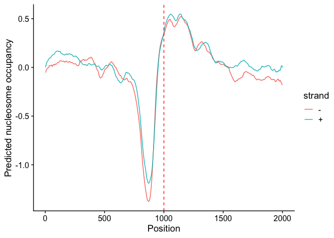
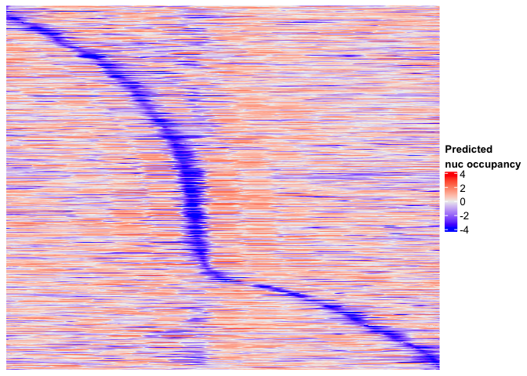
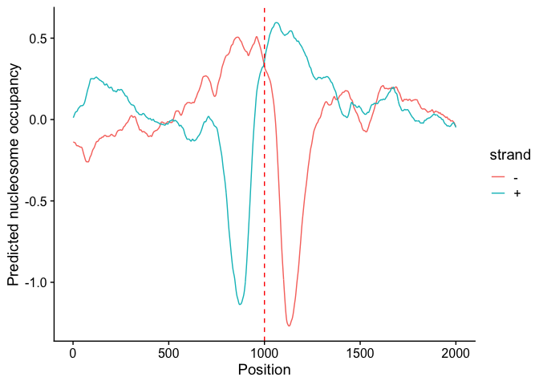
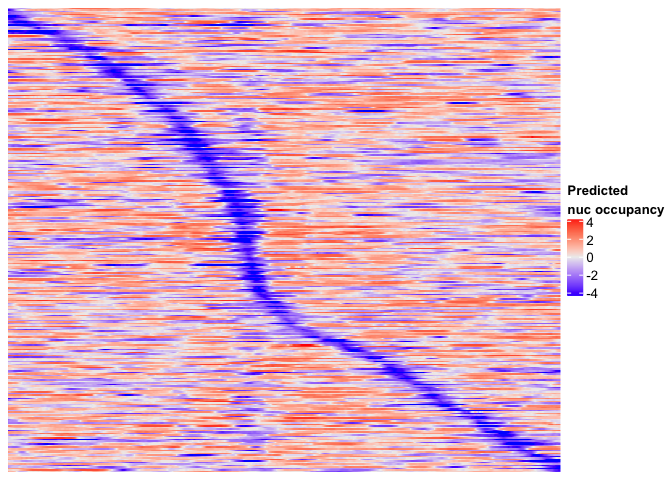
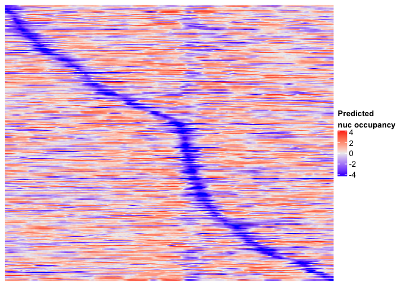

chromWaveR: Prediction of Nuc/TF occupancy from only DNA sequence - yeast promoter example
================
Sebastian Steinhauser
23.03.2020

Load ChromWave model
====================

``` r
library(BSgenome.Scerevisiae.UCSC.sacCer3)
library(TxDb.Scerevisiae.UCSC.sacCer3.sgdGene)
library(genomation)

library(tidyverse)

library(ComplexHeatmap)
library(cowplot)
theme_set(theme_cowplot())

library(reticulate)
use_condaenv(condaenv = 'keras', required = T)
library(kerasR)
library(chromWaveR)

# List all chromWave models available in chromWaveR
availableModels()
```

    ## # A tibble: 4 x 3
    ##   model_name  organism description                                              
    ##   <chr>       <chr>    <chr>                                                    
    ## 1 invitro     sacCer   Model was trained on in vitro nucleosome data from Kapla…
    ## 2 invivo      sacCer   Model was trained on in vivo nucleosome data from Kaplan…
    ## 3 TF-Nuc      sacCer   Model was trained on MNase-seq data from Henikoff et al …
    ## 4 hs_promoter hs       Model was trained on promoter subset of MNase-seq data f…

``` r
# Load chromWave model - yeast in vivo model
model <- loadChromWaveModel(model.name = 'invivo')
```

Nucleosome occupancy prediction for each promoter separately
============================================================

``` r
# Get annotated promoter regions for sacCer3 genome
saccer.promoters <- promoters(x = genes(TxDb.Scerevisiae.UCSC.sacCer3.sgdGene),
                              upstream = 10^3, downstream = 10^3)

# Subset promoter regions for chr15 in this example
saccer.promoters <- saccer.promoters[seqnames(saccer.promoters) == 'chrXV']

# Get sacCer3 genome as GRange
saccer.genome <- GRangesForBSGenome('sacCer3')

# Rmv promoters at chr ends (not long enough 2kb)
saccer.promoters <- subsetByOverlaps(saccer.promoters, saccer.genome,
                                     type = 'within')

# Get promoter sequences
promoter.seqs <- getSeq(BSgenome.Scerevisiae.UCSC.sacCer3, saccer.promoters)

# One-hot encode promoter sequences
promoter.seqs <- oneHotEncode(promoter.seqs)

# Predict nucleosome occupancy from one-hot encoded sequences
promoter.preds <- model$predict(promoter.seqs)

# Smooth nucleosome occupancy predictions before plotting
promoter.smoothPreds <- smoothChromWavePreds(preds = promoter.preds,
                                             model.name = 'invivo')

# PLOT: Metaprofile of predicted nucleosome occupancy around yeast TSSs
promoter.smoothPreds[[1]] %>%
  as.data.frame  %>% tbl_df %>%
  mutate(peak_id = 1:length(V1),
         strand = as.character(strand(saccer.promoters))) %>%
  gather(pos, score, 1:ncol(promoter.smoothPreds[[1]])) %>%
  mutate(pos = as.numeric(gsub('V', '', pos))) %>%
  group_by(strand, pos) %>%
  summarise(mean_score = mean(score), sd_score = sd(score)) %>%
  ggplot(aes(x = pos, y = mean_score, col = strand)) + geom_line() +
  geom_vline(xintercept = 10^3, col = 'red', linetype = 'dashed') +
  xlab('Position') + ylab('Predicted nucleosome occupancy') +
  theme_cowplot()
```



``` r
# PLOT: Heatmap of predicted nucleosome occupancies around yeast TSS
# sorted by distance of NFR to annotated TSS
i.sorted <- apply(promoter.smoothPreds[[1]], 1, which.min) %>% order
Heatmap(promoter.smoothPreds[[1]][i.sorted,],
        show_column_names = F, show_row_names = F,
        cluster_columns = F, cluster_rows = F,
        name = 'Smoothed pred\nnuc occupancy')
```



Nucleosome occupancy prediction per chrs
========================================

``` r
# Get sacCer3 genome as GRange
saccer.genome <- GRangesForBSGenome('sacCer3')

# Subset for chr15 only
saccer.genome <- saccer.genome[seqnames(saccer.genome) == 'chrXV']

# Get DNA sequence for chr15 and one-hot encode
genome.seqs <- getSeq(BSgenome.Scerevisiae.UCSC.sacCer3, saccer.genome)

# Add reverse complement DNA sequence
genome.seqs <- c(genome.seqs, reverseComplement(genome.seqs))

# One-hot encode chr15 fwd and reverse sequence
genome.seqs <- oneHotEncode(genome.seqs)

# Predict nucleosome occupancy for forward and reverse strand of chr15
genome.preds <- model$predict(genome.seqs)

# Smooth nucleosome occupancy predictions
genome.smoothPreds <- smoothChromWavePreds(preds = genome.preds,
                                           model.name = 'invitro')

# Split chrs into tiles of width 1 and assign smoothed nuc prediction
plus.tiles <- tile(saccer.genome, width = 1)[[1]]
strand(plus.tiles) <- '+'
plus.tiles$score <- genome.smoothPreds[[1]][1,]

minus.tiles <- plus.tiles
strand(minus.tiles) <- '-'
minus.tiles$score <- genome.smoothPreds[[1]][2,]

# Combine fwd and rev strand chr15 tiles
chr.tiles <- c(plus.tiles, minus.tiles) %>% sort
rm(plus.tiles, minus.tiles)

# Compute a score matrix for +/-1kb around annotated yeast TSSs from
# smoothed nuc predictions
score.matrix <- ScoreMatrixBin(target = chr.tiles,
                               windows = saccer.promoters,
                               bin.num = unique(width(saccer.promoters)),
                               weight.col = 'score')

# PLOT: Metaprofile of predicted nucleosome occupancy around yeast TSSs
score.matrix@.Data %>%
  as.data.frame  %>% tbl_df %>%
  mutate(peak_id = 1:length(V1),
         strand = as.character(strand(saccer.promoters))) %>%
  gather(pos, score, 1:width(saccer.promoters)[1])  %>%
  mutate(pos = as.numeric(gsub('V', '', pos))) %>%
  group_by(pos, strand) %>%
  summarise(mean_score = mean(score), sd_score = sd(score)) %>%
  ggplot(aes(x = pos, y = mean_score, col = strand)) + geom_line() +
  geom_vline(xintercept = 10^3, col = 'red', linetype = 'dashed') +
  xlab('Position') + ylab('Predicted nucleosome occupancy') +
  theme_cowplot()
```



``` r
# PLOT: Heatmap of predicted nucleosome occupancies around yeast TSS
# sorted by distance of NFR to annotated TSS
nucStrand.heatmaps <- lapply(c('+', '-'), function(s) {
  # Subset score matrix by strand
  strand.matrix <- score.matrix@.Data[as.character(strand(saccer.promoters)) == s,]
  # Sort NFR distance to TSS
  i.sorted <- apply(strand.matrix, 1, which.min) %>% order
  # Plot HEATMAP
  Heatmap(strand.matrix[i.sorted,],
          show_column_names = F, show_row_names = F,
          cluster_columns = F, cluster_rows = F,
          name = 'Smoothed pred\nnuc occupancy')
})
nucStrand.heatmaps[[1]]
```



``` r
nucStrand.heatmaps[[2]]
```


